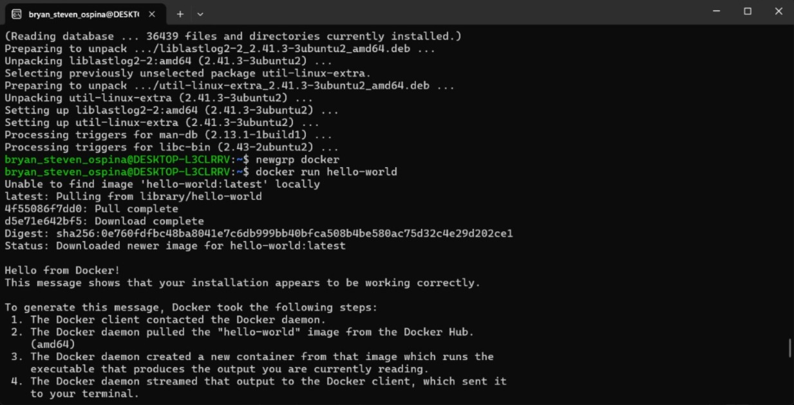
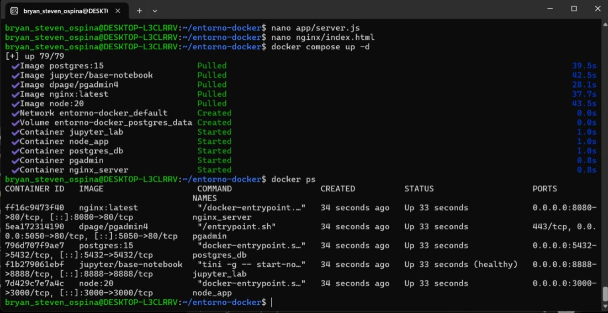
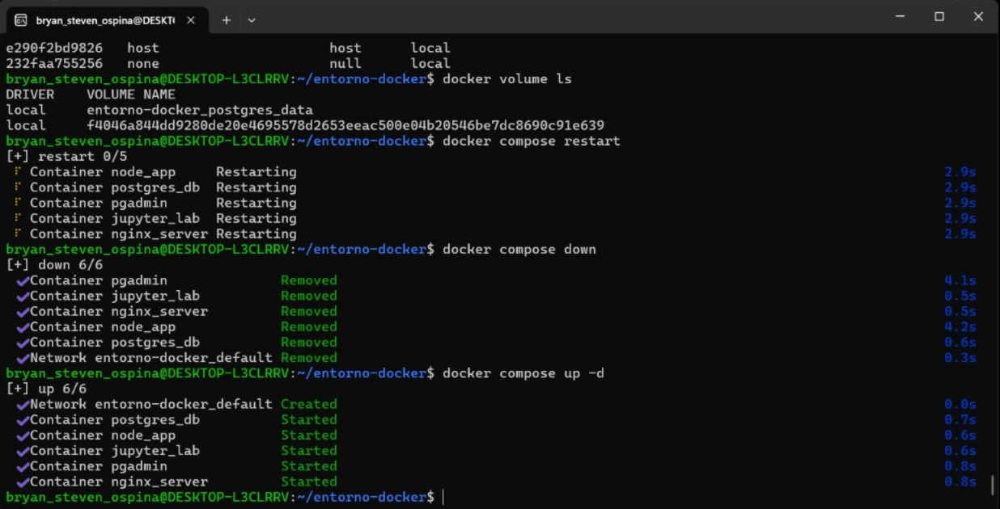
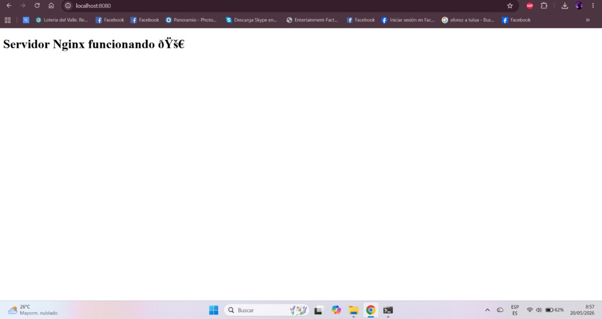
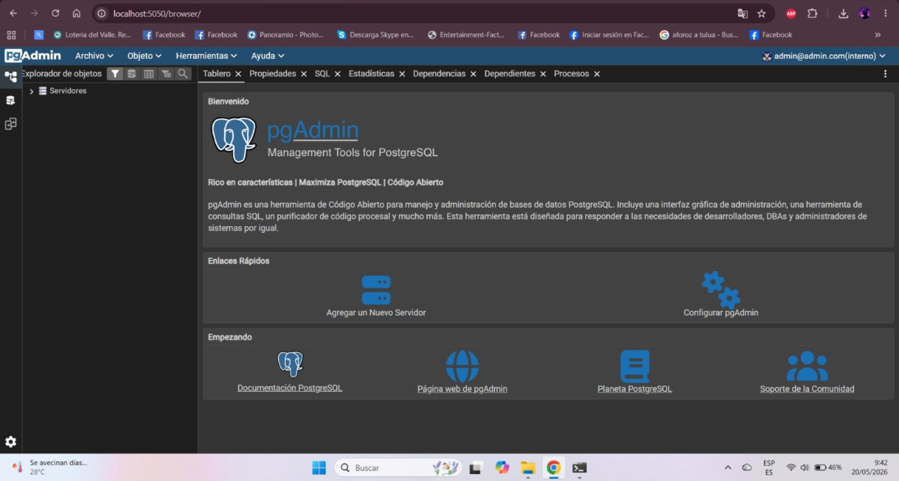
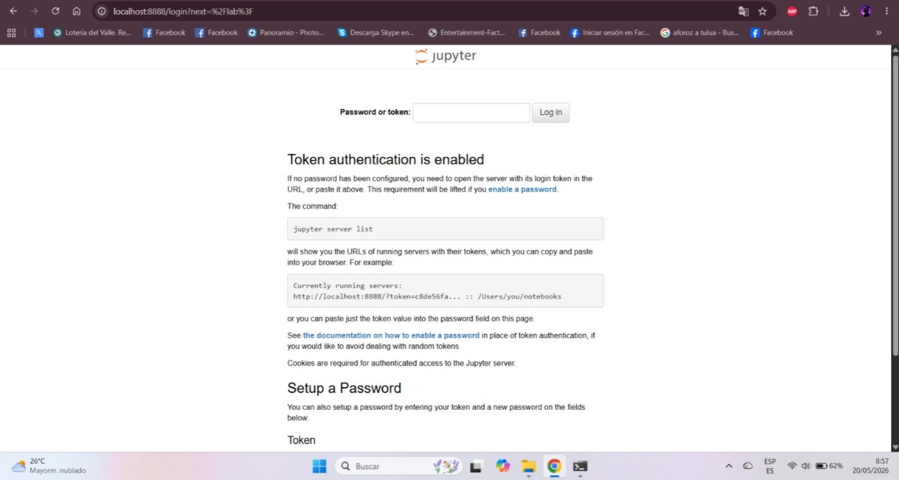

# Entorno Docker con WSL2

## Descripción del proyecto

Este proyecto implementa un entorno controlado basado en contenedores Docker utilizando Ubuntu sobre WSL2 en Windows.

El objetivo es integrar múltiples servicios mediante Docker Compose para prácticas de administración de sistemas operativos, virtualización y administración de contenedores.

---

# Arquitectura del entorno

El entorno contiene los siguientes servicios:

- Servidor web Nginx
- Aplicación Node.js
- PostgreSQL
- pgAdmin 4
- Jupyter Lab

Todos los servicios se comunican mediante Docker Compose utilizando redes Docker internas y volúmenes persistentes.

---

# Requisitos previos

- Windows 11
- WSL2
- Ubuntu 22.04
- Docker
- Docker Compose
- Git
- Cuenta GitHub

---

# Instalación y configuración

## Instalación de WSL2

```bash
wsl --install
```

## Verificación de WSL2

```bash
wsl --status
```

---

# Instalación de Docker

## Actualizar paquetes

```bash
sudo apt update && sudo apt upgrade -y
```

## Instalar dependencias

```bash
sudo apt install apt-transport-https ca-certificates curl software-properties-common -y
```

## Agregar repositorio Docker

```bash
curl -fsSL https://download.docker.com/linux/ubuntu/gpg | sudo gpg --dearmor -o /usr/share/keyrings/docker-archive-keyring.gpg
```

```bash
echo "deb [arch=$(dpkg --print-architecture) signed-by=/usr/share/keyrings/docker-archive-keyring.gpg] https://download.docker.com/linux/ubuntu $(lsb_release -cs) stable" | sudo tee /etc/apt/sources.list.d/docker.list > /dev/null
```

## Instalar Docker Engine

```bash
sudo apt update
```

```bash
sudo apt install docker-ce docker-ce-cli containerd.io docker-buildx-plugin docker-compose-plugin -y
```

---

# Verificación de Docker

## Verificar versión Docker

```bash
docker --version
```

## Verificar Docker Compose

```bash
docker compose version
```

## Probar Docker

```bash
docker run hello-world
```

---

# Estructura del proyecto

```text
entorno-docker/
│
├── app/
│   └── server.js
│
├── nginx/
│   └── index.html
│
├── jupyter/
│
├── screenshots/
│
├── docker-compose.yml
├── .env
└── README.md
```

---

# Configuración Docker Compose

## Levantar servicios

```bash
docker compose up -d
```

## Detener servicios

```bash
docker compose down
```

## Reiniciar servicios

```bash
docker compose restart
```

---

# Servicios implementados

| Servicio | Puerto |
|---|---|
| Nginx | 8080 |
| Node.js | 3000 |
| PostgreSQL | 5432 |
| pgAdmin 4 | 5050 |
| Jupyter Lab | 8888 |

---

# Administración de contenedores

## Ver contenedores activos

```bash
docker ps
```

## Ver logs

```bash
docker logs node_app
```

## Acceder a contenedor

```bash
docker exec -it postgres_db bash
```

## Ver redes Docker

```bash
docker network ls
```

## Ver volúmenes Docker

```bash
docker volume ls
```

---

# Comunicación entre servicios

- Node.js se conecta con PostgreSQL mediante la red interna de Docker Compose.
- pgAdmin permite administrar PostgreSQL desde el navegador.
- Nginx funciona como servidor web principal.
- Jupyter Lab permite ejecutar notebooks desde el navegador.

---

# Publicación en GitHub

## Inicializar Git

```bash
git init
```

## Agregar archivos

```bash
git add .
```

## Crear commit

```bash
git commit -m "Primer entorno Docker con WSL2"
```

## Conectar repositorio remoto

```bash
git remote add origin https://github.com/ByeByeCat/entorno-docker-wsl.git
```

## Subir proyecto

```bash
git branch -M main
```

```bash
git push -u origin main
```

---

# Evidencias de funcionamiento

## Ubuntu en WSL2

<<<<<<< HEAD

=======

>>>>>>> 33fd25b (Corregidas capturas JPEG)

---

## Docker Compose funcionando

<<<<<<< HEAD

=======

>>>>>>> 33fd25b (Corregidas capturas JPEG)

---

## Contenedores levantados

<<<<<<< HEAD

=======

>>>>>>> 33fd25b (Corregidas capturas JPEG)

---

## Servidor Nginx

<<<<<<< HEAD

=======

>>>>>>> 33fd25b (Corregidas capturas JPEG)

---

## pgAdmin 4

<<<<<<< HEAD

=======

>>>>>>> 33fd25b (Corregidas capturas JPEG)

---

## Jupyter Lab

<<<<<<< HEAD

=======

>>>>>>> 33fd25b (Corregidas capturas JPEG)

---

# Resultado esperado

Todos los contenedores deben ejecutarse correctamente y ser accesibles desde el navegador mediante localhost.

El entorno debe permitir:

- Administración de contenedores Docker
- Persistencia de datos con PostgreSQL
- Comunicación entre servicios
- Desarrollo backend con Node.js
- Administración web con pgAdmin
- Ejecución de notebooks en Jupyter Lab

---

# Autor

Bryan Steven Ospina Ramírez-2459353
